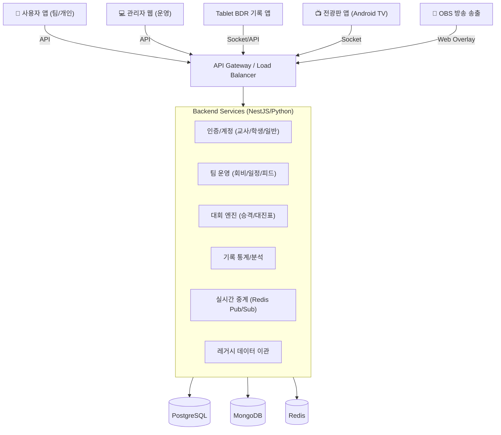

# [BDR] 통합 농구 기록 및 대회 관리 시스템 개발 마스터 플랜

**문서 버전**: v1.0 (Final)
**작성일**: 2025년 12월 13일

---

## 1. 프로젝트 개요 (Executive Summary)
본 프로젝트는 기존의 **경기 기록 프로그램(BDR)**을 핵심 엔진으로 활용하여, **웹 기반 관리자 페이지**, **선수/팀용 모바일 앱**, 그리고 **현장 중계 및 디스플레이 솔루션**을 유기적으로 연결하는 **통합 농구 플랫폼** 구축을 목표로 합니다.
학교 스포츠 클럽부터 성인 동호회까지 아우르는 생태계를 조성하며, **법적 리스크 제로(Zero-Risk 개인정보보호)**와 **독점적 기술 권리(특허 확보)**를 기반으로 시장을 선점합니다.

---

## 2. 시스템 아키텍처 (System Architecture)

### 2.1 전체 시스템 구조도

### 2.2 기술 스택 (Tech Stack)
*   **Frontend (App)**: React Native (Expo) - *Android/iOS 동시 지원*
*   **Frontend (Admin)**: Next.js (React) - *SEO 및 대시보드 최적화*
*   **Backend**: NestJS (Node.js) - *안정성 및 확장성*
*   **Database**: PostgreSQL - *복잡한 대회/기록 데이터의 무결성 보장*
*   **Real-time**: Socket.io + Redis - *0.1초 단위 점수 동기화*

---

## 3. 핵심 기능 명세 (Core Features)

### 3.1 사용자 앱 (User App) - "나만을 위한 농구 비서"
*   **개인화 UX (Personalization)**:
    *   **관심 분야 설정**: 가입 시 유소년, 청소년, 대학부, 성인부, 시니어, 여성부 등 관심 태그 설정.
    *   **큐레이션 홈**: 설정한 태그에 맞는 대회 공지, 모집글, 뉴스만 필터링하여 노출.
*   **팀 슈퍼 앱 (Team Management)**:
    *   **팀 피드**: 팀원 전용 폐쇄형 SNS (사진/영상/공지 공유).
    *   **회비 관리**: 오픈뱅킹 API 연동을 통한 회비 납부 현황 자동 확인 및 장부 관리.
    *   **일정 관리**: 연습경기, 대회 일정 공유 캘린더 (참석 투표 기능 포함).
    *   **상호 승인 가입**: '팀장의 승인'과 '선수의 수락'이 모두 있어야 팀 등록 완료 (오등록 방지).
*   **대회 아카이브**: 연도별, 대회별 우승팀 및 기록 히스토리 영구 보존.

### 3.2 관리자 페이지 (Admin Web) - "통합 컨트롤 타워"
*   **대회 운영 자동화**:
    *   **계층형 리그 승격**: 하위 리그(지역 교육장배) 우승 팀을 상위 리그(전국대회) 시드로 자동 배정.
    *   **대진표 생성**: 참가 팀 수에 따른 토너먼트/리그 대진표 자동 생성 알고리즘.
*   **미성년자/학교 관리**:
    *   **교사 인증 승인**: 교사 자격 증빙(EPKI/재직증명서) 검수 및 승인.
    *   **학교 코드 관리**: 전국 학교 DB 연동 및 팀 생성 권한 관리.
*   **레거시 이관**: '동아리농구방' 다음카페 크롤링 데이터 매핑 및 게시판 관리.

### 3.3 BDR 생태계 아키텍처 (Ecosystem Hierarchy)
*   **슈퍼 관리자 (Super Admin - BDR HQ)**:
    *   **플랫폼 총괄**: 전체 서버, DB, 정책 관리.
    *   **표준 데이터 정의 (Master Data)**: 모든 대회의 기준이 되는 **종별/디비전 프리셋(Preset)** 정의.
        *   예: `[학교스포츠클럽 표준]` → (초등/중등/고등), `[i-League 표준]` → (i1~i4w).
    *   **권한 부여**: 지역 협회, 교육청, 학교 관리자에게 **"대회 생성 권한"** 위임.
*   **조직 관리자 (Org Admin)**:
    *   **대상**: 시도농구협회, 교육청 장학사, 학교스포츠클럽 담당 교사.
    *   **권한**:
        *   자신이 속한 지역/단체의 대회 생성 및 운영.
        *   슈퍼 관리자가 정의한 **프리셋을 불러와서** 손쉽게 대회 설정 (수기 입력 최소화).
        *   자체적인 로컬 규정 추가 가능.

### 3.3 현장 중계 및 디스플레이 (Broadcasting)
*   **OBS 스트리밍 연동**:
    *   별도 장비 없이 **웹 URL(Browser Source)**만 입력하면 방송용 스코어보드 오버레이 송출.
    *   배경 투명화(Chroma Key) 자동 적용.
*   **전용 전광판 앱 (Android TV)**:
    *   32~40인치 대형 디스플레이용 앱 (태블릿/스마트TV 설치).
    *   **스마트 광고 송출**: 작전타임/하프타임 등 경기 중단 시 후원사 광고 영상 자동 재생.
    *   **선수 소개 모드**: 경기 전 양 팀 로스터 그래픽 효과 송출.

---

## 4. 특화 전략: 학교스포츠클럽 & 미성년자 보호

### 4.1 미성년자 개인정보보호 (Zero-Risk Strategy)
*   **원칙**: 플랫폼은 학생 개인정보를 최소화하고, 수집의 주체를 '학교(교사)'로 둠.
*   **[1단계] 교사 위임 등록 (Beta)**:
    *   교사가 학교 대표 계정으로 팀을 생성.
    *   학생 정보는 `학교`, `학년/반`, `식별번호(생년월일 앞자리)`, `이름`, `등번호`만 수집 (전화번호 수집 X).
    *   **법적 논리**: 학교 교육활동의 일환으로 교사가 학생 명단을 관리하는 것이며, 플랫폼은 이를 위한 '도구'를 제공하는 위수탁 관계 성립.
*   **[2단계] 보호자 안심 본인인증 (Official)**:
    *   학생 본인 가입 시, 부모님 휴대폰 인증(NICE/다날 등)을 통한 법정대리인 동의 필수 적용.

### 4.2 계층형 리그 구조
*   **구조**: `지역 예선(Local)` → `광역 본선(Regional)` → `전국 결선(National)` 
*   **데이터 연동**: 지역 예선 기록 데이터가 상위 대회로 자동 이관되어, 전국 대회에서 '지역 예선 평균 득점' 등의 해설 자막 송출 가능.

---

## 5. 지식재산권(IP) 및 특허 확보 전략

### 5.1 출원 대상 핵심 기술 (Patent Claims)
1.  **[BM특허] 계층형 스포츠 리그 승격 및 시드 배정 자동화 시스템**
    *   *내용*: 하위 리그 경기 기록 데이터를 가중치 분석하여 상위 리그 시드 배정을 자동화하는 로직.
2.  **[시스템특허] 경기 상황 인식 기반의 스마트 광고 송출 시스템**
    *   *내용*: BDR 앱의 경기 상태(Timeout, End of Quarter) 신호를 트리거로 하여, 현장 전광판과 중계 화면의 광고 재생을 동기화 제어하는 기술.
3.  **[BM특허] 교사 인증 기반의 미성년자 스포츠 팀 위임 관리 방법**
    *   *내용*: 교사 신원 인증을 루트(Root) 권한으로 하여, 미성년 선수의 가입 절차 없이 선수 데이터를 생성하고 추후 매칭(Claim)하는 프로세스.

### 5.2 출원 로드맵
*   **D-Day (개발 착수)**: 선행기술조사 및 아이디어 구체화.
*   **D+2개월 (베타 오픈 전)**: **특허 가출원(Provisional)** 진행 (우선권 확보, 비용 절감).
*   **D+5개월 (정식 오픈 전)**: **정규 출원 및 우선심사 청구** (3~6개월 내 등록 목표).
*   **D+12개월**: 특허 등록 완료 및 마케팅 활용("특허받은 리그 시스템").

---

## 6. 단계별 개발 로드맵 (Development Roadmap)

### Phase 0: 기획 및 법적 검토 (1개월)
*   기획서 확정 및 UI/UX 설계.
*   특허 아이디어 가출원.
*   개인정보처리방침 및 서비스 이용약관 법률 검토.

### Phase 1: 파운데이션 구축 (2~3개월) - **[현재 진행 중]**
*   **[완료]** Backend 서버 및 DB 구축 (승격형 리그 구조, 팀/선수, 대회/경기 엔티티 완료).
*   **[진행 중]** 관리자 웹(Admin) MVP 개발.
    *   **[완료]** 대회 운영 (대진표 생성, 경기 기록 입력, 실시간 순위 산정).
    *   **[완료]** 팀/선수 관리 (등록, 로스터, 프로필 이미지, 참가 신청 프로세스).
    *   **[예정]** 교사 인증 및 권한 승인 시스템.
*   **[예정]** BDR 앱 통신 모듈 개발 (Socket 연동).

### Phase 2: 베타 오픈 - 학교스포츠클럽 (4~5개월)
*   **OBS 오버레이 시스템** 오픈.
*   **교사 위임 등록 시스템** 가동.
*   교육청 협력 시범 리그 운영 (지역 예선).
*   학생용 앱(Lite) - 로그인 없이 경기 결과 조회.

### Phase 3: 정식 오픈 - 확장 (6~7개월)
*   **전광판 앱 (Android TV)** 출시.
*   **사용자 앱 정식 버전** 출시 (일반 동호회 기능 포함).
*   레거시(동아리농구방) 데이터 이관 완료.
*   **특허 정규 출원.**

### Phase 4: 생태계 완성 (8개월~)
*   **전국 대회 시스템** 가동.
*   수익화 모델(광고, 프리미엄 멤버십) 도입.
*   **입시용 포트폴리오 PDF 출력** 서비스 오픈.
